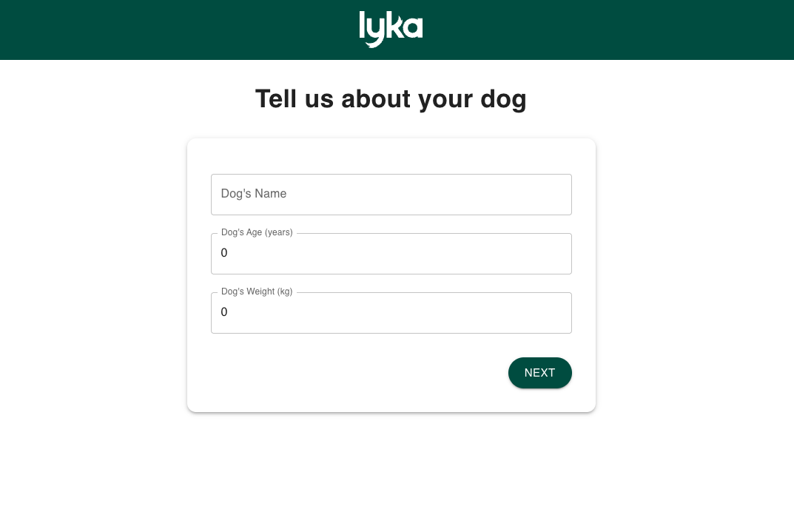
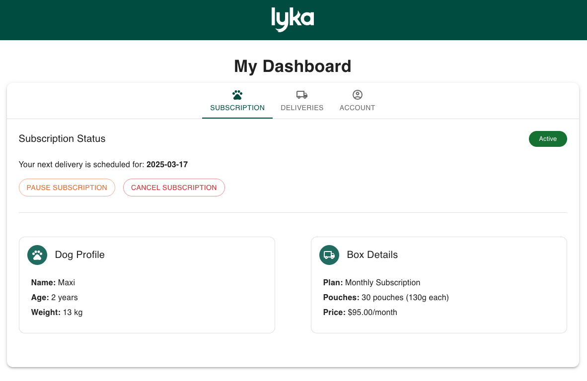

# Dog Food Subscription Service

An e-commerce application for subscribing to personalized dog food deliveries. This project allows customers to sign up for a monthly subscription box of fresh dog food in personalized pouches, sized appropriately for their dog.




## Overview

This application was developed as a take-home exercise, implementing a full-stack e-commerce subscription platform with:

- A React/TypeScript frontend
- A NestJS backend
- PostgreSQL database

## Features

- Dog profile creation with name, age, and weight input
- Personalized subscription recommendation based on dog details
- Subscription management (pause, cancel)
- Payment simulation
- User dashboard with subscription status and delivery history

## Tech Stack

### Frontend
- React with TypeScript
- Vite for build tooling
- Material UI for component library
- React Router for navigation
- React Hook Form for form handling

### Backend
- NestJS framework
- TypeORM for database interaction
- PostgreSQL database
- Class Validator for DTO validation

## Setup Instructions

### Prerequisites

- Node.js (v14+)
- npm or yarn
- PostgreSQL

### Database Setup

```bash
# Create database
createdb dogfood
```

> Note: If `createdb` command is not found, you may need to add PostgreSQL bin directory to your PATH or use:
> ```bash
> psql postgres -c 'CREATE DATABASE dogfood;'
> ```

### Backend Setup

```bash
# Navigate to backend directory
cd backend

# Install dependencies
npm install

# Start the development server
npm run start:dev
```

The API will be available at http://localhost:3001/api

### Frontend Setup

```bash
# Navigate to frontend directory
cd frontend

# Install dependencies
npm install

# Start the development server
npm run dev
```

The application will be available at http://localhost:3000

## Application Structure

### Frontend

```
frontend/
├── public/
│   └── lyka-logo.svg
├── src/
│   ├── components/
│   │   ├── dashboard/
│   │   │   ├── cards/
│   │   │   │   ├── AccountInfoCard.tsx
│   │   │   │   ├── DogProfileCard.tsx
│   │   │   │   ├── PaymentMethodCard.tsx
│   │   │   │   ├── StatusCard.tsx
│   │   │   │   └── SubscriptionDetailsCard.tsx
│   │   │   ├── AccountTab.tsx
│   │   │   ├── DashboardTabs.tsx
│   │   │   ├── DeliveriesTab.tsx
│   │   │   ├── DeliveryTable.tsx
│   │   │   └── SubscriptionTab.tsx
│   │   └── Header.tsx
│   ├── context/
│   │   └── AppContext.tsx
│   ├── pages/
│   │   ├── Dashboard.tsx
│   │   ├── DogProfileForm.tsx
│   │   ├── SubscriptionForm.tsx
│   │   ├── SubscriptionRecommendation.tsx
│   │   └── SuccessPage.tsx
│   ├── services/
│   │   └── api.ts
│   ├── themes/
│   │   └── main.ts
│   ├── types/
│   │   └── index.ts
│   ├── App.tsx
│   └── main.tsx
└── vite.config.ts
```

### Backend

```
backend/
├── src/
│   ├── dogs/
│   │   ├── dto/
│   │   ├── entities/
│   │   ├── dogs.controller.ts
│   │   ├── dogs.module.ts
│   │   └── dogs.service.ts
│   ├── payments/
│   │   ├── dto/
│   │   ├── entities/
│   │   ├── payments.controller.ts
│   │   ├── payments.module.ts
│   │   └── payments.service.ts
│   ├── subscriptions/
│   │   ├── dto/
│   │   ├── entities/
│   │   ├── subscription-scheduler.service.ts
│   │   ├── subscriptions.controller.ts
│   │   ├── subscriptions.module.ts
│   │   └── subscriptions.service.ts
│   ├── users/
│   │   ├── dto/
│   │   ├── entities/
│   │   ├── users.controller.ts
│   │   ├── users.module.ts
│   │   └── users.service.ts
│   ├── app.controller.ts
│   ├── app.module.ts
│   ├── app.service.ts
│   └── main.ts
├── nest-cli.json
└── package.json
```

### Areas for Improvement

**Form Management**: The `SubscriptionForm.tsx` component is too large and could be refactored into smaller components:
   ```
   SubscriptionForm/
   ├── CustomerInfoForm.tsx
   ├── PaymentForm.tsx
   ├── OrderSummary.tsx
   └── index.tsx
   ```